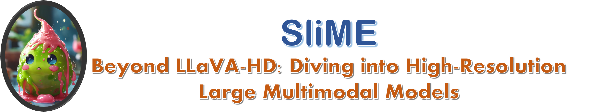

<!-- # SliME -->

# Beyond LLaVA-HD: Diving into High-Resolution Large Multimodal Models

 
<a href='https://arxiv.org/abs/2406.08487'></a>
<a href='https://huggingface.co/collections/yifanzhang114/slime-665bcb2d0d71762b86fdbd2d'></a>
<a href='https://huggingface.co/datasets/yifanzhang114/SMR'></a>


<p align="center">
    
</p>

<font size=7><div align='center' >  [[📖 arXiv Paper](https://arxiv.org/abs/2406.08487)] [[📊 Dataset](https://huggingface.co/datasets/yifanzhang114/SMR)][[🏆 Models](https://huggingface.co/collections/yifanzhang114/slime-665bcb2d0d71762b86fdbd2d)]  </div></font>


## 🔥 Update
- [06/11]🔥SliME is coming! We release the [paper](https://arxiv.org/abs/2406.08487), [code](https://github.com/yfzhang114/SliME), [models](https://huggingface.co/collections/yifanzhang114/slime-665bcb2d0d71762b86fdbd2d), and [data](https://huggingface.co/datasets/yifanzhang114/SMR) for SliME!
- [06/11]🔥SliME-70B will be released soon.

## 👀 Contents
- [Install](#install)
- [Model](#model)
- [Preparation](#preparation)
- [Train](#train)
- [Evaluation](#evaluation)
- [Examples](#examples)
- [Citation](#citation)


## 🔮 Install
Please follow the instructions below to install the required packages.


1. Clone this repository
```bash
git clone https://github.com/yfzhang114/SliME.git
```

2. Install Package
```bash
conda create -n slime python=3.10 -y
conda activate slime
cd SliME
pip install --upgrade pip  # enable PEP 660 support
pip install -e .
```

3. Install additional packages for training cases
```bash
pip install -e ".[train]"
pip install ninja
pip install datasets
pip install flash-attn --no-build-isolation

```

## 🔍 Model

We provide all our fully finetuned models on Stage 1/2 and 3 data for SliME:

| Model | Base LLM | Vision Encoder | Finetuning Data | Finetuning schedule | Download |
|----------|----------|----------------|---------------|--------------------|------------------|
| SliME-7B | Vicuna-7B-v1.5 | CLIP-L | SharedGPT+SMR | full_ft | [ckpt](https://huggingface.co/yifanzhang114/SliME-vicuna-7B) |
| SliME-8B | Llama-3-8B-Instruct | CLIP-L | SharedGPT+SMR | full_ft | [ckpt](https://huggingface.co/yifanzhang114/SliME-Llama3-8B) |
| SliME-13B | Vicuna-13B-v1.5 | CLIP-L | SharedGPT+SMR | full_ft | [ckpt](https://huggingface.co/yifanzhang114/SliME-vicuna-13B) |
| SliME-70B | Llama-3-70B-Instruct | CLIP-L | SharedGPT+SMR | Lora | [ckpt](https://huggingface.co/yifanzhang114/SliME-llama3-70B) |


Here are the pretrained weights on Stage 1/2 data only:
| Model  | Base LLM | Vision Encoder | Pretrain Data | Finetuning schedule | Download |
|----------|----------|----------------|---------------|--------------------|------------------|
| SliME-7B | Vicuna-7B-v1.5 | CLIP-L | LLaVA-Pretrain | 1e | [ckpt](https://huggingface.co/yifanzhang114/SliME-vicuna-7B) |
| SliME-8B | Llama-3-8B-Instruct | CLIP-L | LLaVA-Pretrain | 1e | [ckpt](https://huggingface.co/yifanzhang114/SliME-Llama3-8B) |
| SliME-13B | Vicuna-13B-v1.5 | CLIP-L | LLaVA-Pretrain | 1e | [ckpt](https://huggingface.co/yifanzhang114/SliME-vicuna-13B) |
| SliME-70B | Llama-3-70B-Instruct | CLIP-L | LLaVA-Pretrain | 1e | [ckpt](https://huggingface.co/yifanzhang114/SliME-llama3-70B) |


## 🔮 Preparation
### Dataset
Please follow [LLaVA](https://github.com/haotian-liu/LLaVA) and [SharedGPT4V](https://sharegpt4v.github.io/) to prepare the corresponding images and data.

### SMR data structure
```
data
├── arxivqa
│   └── images
├── DVQA
│   └── images
├── Geometry3K
│   └── 0-2400 dirs
├── ChartQA
│   └── train_images
└── GeoQA3
│    ├── image
│    └── json
├── mathvision
├── scienceqa
├── tabmwp
└── GeoQA3
│    ├── train
│    └── test
│    └── val
└── ai2d
│    ├── abc_images
│    └── images
└── geoqa+
│   └── images
```

1. Arxiv QA
Download images using this [download url](https://huggingface.co/datasets/MMInstruction/ArxivQA/resolve/main/images.tgz)

```python
python playground/data/process_arxivqa.py
```

2. DVQA  

Download images using this [url](https://drive.google.com/file/d/1iKH2lTi1-QxtNUVRxTUWFvUvRHq6HAsZ/view?usp=sharing).

3. ChartQA

Clone this [repo](https://github.com/vis-nlp/ChartQA)

extract all the training images in ```ChartQA_Dataset/train/png``` into ```ChartQA```

4. Geometry3K

Download images using this [url](https://lupantech.github.io/inter-gps/geometry3k/train.zip).

The image path in our json file will be ```os.path.join(f'Geometry3K/i', 'img_diagram.png')```

5. GeoQA3

Download images using this [url](https://drive.google.com/drive/folders/1fiLTJUq7EPiZHs6AxundNfNEDLw4gtP5?usp=sharing)

extract all the training images in ```GeoQA3/image```

6. MathVision

Download images using this [url](https://github.com/mathvision-cuhk/MathVision/images)

Our data will not include the images from test-mini split automatically

7. ScienceQA

```bash
wget https://scienceqa.s3.us-west-1.amazonaws.com/images/train.zip
wget https://scienceqa.s3.us-west-1.amazonaws.com/images/val.zip
wget https://scienceqa.s3.us-west-1.amazonaws.com/images/test.zip

unzip -q train.zip
unzip -q val.zip
unzip -q test.zip

rm train.zip
rm val.zip
rm test.zip
```

8. Tabmwp

Download images using this [url](https://github.com/lupantech/PromptPG/tree/main/data/tabmwp/tables)

9. TextbookQA

Download images using this [url](https://ai2-public-datasets.s3.amazonaws.com/tqa/tqa_train_val_test.zip)

10. AI2D: 

Download images using this [url](https://drive.google.com/file/d/1dqqa3MnrxMXaU_K9JA6C83je32ibwdOY/view?usp=sharing)

11. GeoQA+

Download images using this [url](https://huggingface.co/OpenGVLab/InternVL/resolve/main/geoqa%2B_images.zip)

## 📈 Train

<div align='center' >
<details>
<summary> Click to see the detail model structure</summary>
<p align="center">

</details>
</div>


SliME training consists of three stages: (1) training the global projector and attention adapter specifically; (2) training the local compression layer; and (3) training the full model.

SliME is trained on 8 A100 GPUs with 80GB memory. To train on fewer GPUs, you can reduce the `per_device_train_batch_size` and increase the `gradient_accumulation_steps` accordingly. Always keep the global batch size the same: `per_device_train_batch_size` x `gradient_accumulation_steps` x `num_gpus`.

Please make sure you download and organize the data following [Preparation](#preparation) before training.

If you want to train and finetune SliME, please run the following command for SliME-7B with image size 336:

```bash
bash scripts/vicuna/vicuna_7b_pt.sh
bash scripts/vicuna/vicuna_7b_sft.sh
```
or for SliME-8B with image size 336:
```bash
bash scripts/llama/llama3_8b_pt.sh
bash scripts/llama/llama3_8b_sft.sh
```
Because we reuse the pre-trained projecter weights from the SliME-7B, you can directly use the sft commands stage-3 instruction tuning by changing the ```PROJECTOR_DIR```:
```bash
bash scripts/llama/llama3_8b_sft.sh
```
Please find more training scripts of in `scripts/`.


## 📈 Evaluation
We perform evaluation on several image-based benchmarks. Please see [Evaluation](docs/Evaluation.md) for the detailes.

<div align=center>

</div>

If you want to evaluate the model on image-based benchmarks, please use the scripts in `scripts/MODEL_PATH/eval`. 
For example, run the following command for TextVQA evaluation with SliME-7B:

```bash
bash scripts/llama/eval/textvqa.sh
```
Please find more evaluation scripts in `scripts/MODEL_PATH`.

## 👀 Examples
We provide some examples in this section. More examples can be found in our [project page](https://SliME.github.io/).

### Hi-Resolution Understanding
<div align=center>

</div>

<div align='center' >
<details>
<summary> Click to expand more examples</summary>
<p align="center">
    
    
    
</details>
</div>


## Citation
If you find this repo useful for your research, please consider citing the paper
```
@misc{zhang2024llavahd,
      title={Beyond LLaVA-HD: Diving into High-Resolution Large Multimodal Models}, 
      author={Yi-Fan Zhang and Qingsong Wen and Chaoyou Fu and Xue Wang and Zhang Zhang and Liang Wang and Rong Jin},
      year={2024},
      eprint={2406.08487},
      archivePrefix={arXiv},
      primaryClass={cs.CV}
}
```

## Acknowledgement
We would like to thank the following repos for their great work:

- This work is built upon the [LLaVA](https://github.com/haotian-liu/LLaVA).
- This work utilizes LLMs from , [Vicuna](https://github.com/lm-sys/FastChat), and [Llama3](https://huggingface.co/meta-llama).

## License
The data and checkpoint is intended and licensed for research use only. They are also restricted to uses that follow the license agreement of LLaVA, LLaMA, Vicuna and GPT-4. The dataset is CC BY NC 4.0 (allowing only non-commercial use) and models trained using the dataset should not be used outside of research purposes.