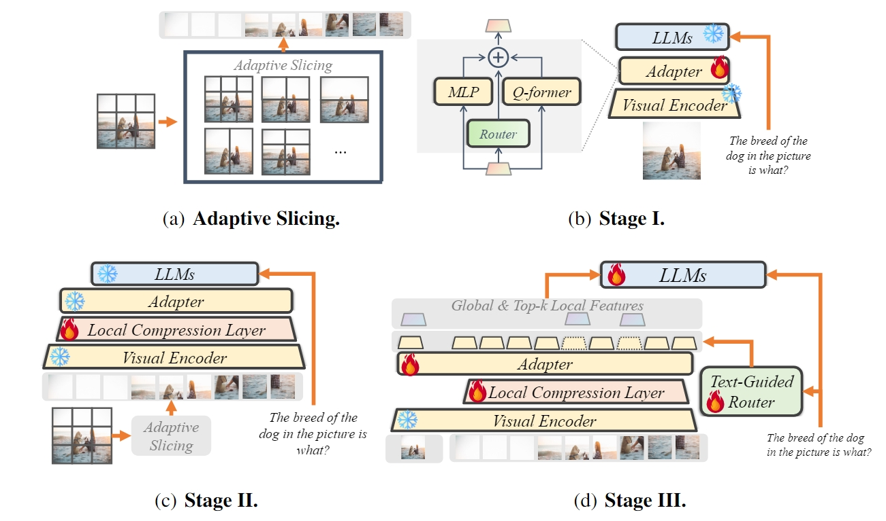

## Evaluation benchmark
Refer to this [repo](https://github.com/BradyFU/Video-MME) for data download and extraction

## Method

<div align='center'>
<details>
<summary>Click to see the detailed model structure</summary>
<p align="center">

</details>
</div>

The SliME strategy emphasizes the importance of global context in relation to local image details. For videos, we apply average pooling to the image features of all 8 frames to extract the global feature. These 8 frames serve as local features, compressed by our local compression layer. Thanks to this compression layer, although the maximum model length is just 2048, we can process up to 10 frames, ensuring rich temporal information is retained.

The inference code can be found in ```llava/eval/video``. Just edit some lines of the code to adapt it to your needs.


```
num_patch_width, num_patch_height = 4, 2 ## line 240 in llava_arch, enables us to include 8 frames
process_images # line 247 in mm_utils, avoids doing image patching
```

## Results

|      Model     | LLM Params |        |               | Overall (%) |        | Short Video (%) |          | Medium Video (%) |          | Long Video (%) |          |
|:--------------:|:----------:|:------:|:-------------:|:-----------:|:------:|:---------------:|:--------:|:----------------:|:--------:|:--------------:|:--------:|
|      Model     | LLM Params | Frames |      Date     |   w/o subs  | w subs |     w/o subs    |  w subs  |     w/o subs     |  w subs  |    w/o subs    |  w subs  |
|     ST-LLM     |     7B     |   64   |   2024-06-15  |     37.9    |  42.3  |       45.7      |   48.4   |       36.8       |   41.4   |      31.3      |   36.9   |
|   Video-LLava  |     7B     |    8   |   2024-06-15  |     39.9    |  41.6  |       45.3      |   46.1   |        38        |   40.7   |      36.2      |   38.1   |
|   QwenVL-Chat  |     7B     |    4   |   2024-06-15  |     41.1    |  41.9  |       46.9      |   47.3   |       38.7       |   40.4   |      37.8      |   37.9   |
| ShareGPT4Video |     8B     |   16   |   2024-06-17  |     39.9    |  43.6  |       48.3      |   53.6   |       36.3       |   39.3   |       35       |   37.9   |
|   ShareGemini  |     7B     |   64   |   2024-06-20  |     43.2    |  47.9  |       49.1      |   52.8   |       41.3       | **47.3** |      39.1      | **43.4** |
|    **SliME**   |   **8B**   |  **8** | **2024-6-12** |   **45.3**  |  47.2  |     **53.3**    | **55.4** |     **42.7**     |   44.4   |    **39.8**    |   41.7   |